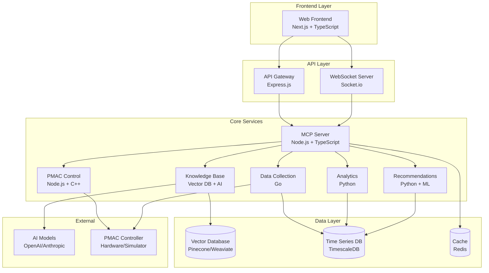

# Design Document

## Overview

Система помощника наладчика станков с ЧПУ (PMAC Assistant System) представляет собой модульную веб-платформу, построенную на основе MCP (Model Context Protocol) сервера. Система обеспечивает интеллектуальное взаимодействие с контроллером PMAC через ИИ помощника, управление переменными, сбор и анализ данных, а также предоставление рекомендаций.

Архитектура системы основана на принципах модульности, безопасности и масштабируемости, с возможностью работы как с реальным контроллером PMAC, так и в режиме имитации для разработки и тестирования.

## Architecture

### High-Level Architecture



### Service Communication

Система использует комбинацию синхронных и асинхронных коммуникаций:

- **HTTP REST API** для основных операций CRUD
- **WebSocket** для real-time обновлений данных
- **Message Queue (Redis)** для асинхронной обработки задач
- **gRPC** для внутренней коммуникации между сервисами (опционально)

## Components and Interfaces

### 1. MCP Server Core

**Назначение**: Центральный компонент для управления ИИ моделями и маршрутизации запросов

**Технологии**: Node.js, TypeScript, MCP Protocol

**Интерфейсы**:

```typescript
interface MCPServerCore {
  // Model Management
  switchModel(modelId: string, config?: ModelConfig): Promise<void>
  getCurrentModel(): ModelInfo
  getAvailableModels(): ModelInfo[]
  
  // Request Routing
  routeRequest(request: MCPRequest): Promise<MCPResponse>
  
  // Token Optimization
  optimizeContext(context: string): string
  getCacheKey(request: MCPRequest): string
  
  // Health & Monitoring
  getHealthStatus(): HealthStatus
  getMetrics(): SystemMetrics
}

interface ModelConfig {
  maxTokens: number
  temperature: number
  systemPrompt?: string
  tools?: string[]
}

interface MCPRequest {
  type: 'chat' | 'tool_call' | 'document_query'
  payload: any
  context?: string
  userId?: string
}
```

**Компоненты**:
- **Model Manager**: Управление подключениями к ИИ моделям
- **Request Router**: Маршрутизация запросов между модулями
- **Context Optimizer**: Оптимизация контекста для экономии токенов
- **Cache Manager**: Кэширование ответов и контекста

### 2. PMAC Control Module

**Назначение**: Управление контроллером PMAC и его переменными

**Технологии**: Node.js, TypeScript, C++ (для низкоуровневого доступа)

**Интерфейсы**:

```typescript
interface PMACController {
  // Connection Management
  connect(config: PMACConnectionConfig): Promise<void>
  disconnect(): Promise<void>
  getConnectionStatus(): ConnectionStatus
  
  // Variable Operations
  readVariable(type: PMACVariableType, address: number): Promise<number>
  writeVariable(type: PMACVariableType, address: number, value: number): Promise<void>
  batchRead(variables: VariableRequest[]): Promise<VariableResponse[]>
  batchWrite(variables: VariableWrite[]): Promise<void>
  
  // System Operations
  getSystemStatus(): Promise<PMACStatus>
  executeCommand(command: string): Promise<CommandResult>
  emergencyStop(): Promise<void>
  
  // Program Management
  loadProgram(programId: number, code: string): Promise<void>
  executeProgram(programId: number): Promise<void>
  stopProgram(): Promise<void>
}

interface PMACConnectionConfig {
  mode: 'real' | 'simulation'
  connection?: {
    type: 'ethernet' | 'serial' | 'usb'
    host?: string
    port?: number
    device?: string
    baudRate?: number
  }
  simulation?: {
    dataFile?: string
    responseDelay?: number
  }
}

interface PMACStatus {
  controllerState: 'idle' | 'running' | 'error' | 'homing' | 'programming'
  communicationStatus: 'connected' | 'disconnected' | 'error'
  coordinates: Record<string, number>
  variables: {
    P: Record<number, number>  // Program variables (1-8192)
    Q: Record<number, number>  // Coordinate variables (1-8192)
    I: Record<number, number>  // I/O variables (1-8192)
    M: Record<number, number>  // Motion variables (1-8192)
    L: Record<number, number>  // Local variables (1-8192)
  }
  axes: Record<string, AxisStatus>
  system: SystemInfo
}
```

**Компоненты**:
- **Connection Manager**: Управление подключением к контроллеру
- **Variable Manager**: Операции с переменными PMAC
- **Command Processor**: Выполнение команд контроллера
- **Safety Controller**: Контроль безопасности операций
- **Simulator**: Имитация контроллера для разработки

### 3. Knowledge Base Module

**Назначение**: Управление документацией и интеграция с ИИ для объяснений

**Технологии**: Node.js, Vector Database, AI Models

**Интерфейсы**:

```typescript
interface KnowledgeBase {
  // Document Management
  addDocument(file: File, metadata: DocumentMetadata): Promise<string>
  removeDocument(documentId: string): Promise<void>
  updateDocument(documentId: string, updates: Partial<DocumentMetadata>): Promise<void>
  
  // AI-Powered Search & Explanation
  askQuestion(question: string, context?: string): Promise<AIResponse>
  explainConcept(concept: string, userLevel?: 'beginner' | 'intermediate' | 'expert'): Promise<AIResponse>
  getRecommendations(currentState: PMACStatus, issue?: string): Promise<Recommendation[]>
  
  // Vector Search
  searchDocuments(query: string, filters?: SearchFilters): Promise<SearchResult[]>
  findSimilarContent(content: string): Promise<SearchResult[]>
}

interface DocumentMetadata {
  title: string
  type: 'manual' | 'reference' | 'tutorial' | 'configuration'
  category: string
  tags: string[]
  machineType?: string
  version: string
  language: string
}

interface AIResponse {
  answer: string
  confidence: number
  sources: DocumentReference[]
  relatedTopics: string[]
  recommendations?: string[]
}

interface DocumentReference {
  documentId: string
  title: string
  pageNumber?: number
  section?: string
  relevanceScore: number
}
```

**Компоненты**:
- **Document Processor**: Обработка и индексация документов
- **Vector Store**: Хранение векторных представлений
- **AI Integration**: Интеграция с ИИ моделями для объяснений
- **Search Engine**: Поиск по документам
- **Content Analyzer**: Анализ и категоризация контента

### 4. Data Collection Module

**Назначение**: Сбор данных с контроллера PMAC в реальном времени

**Технологии**: Go, TimescaleDB

**Интерфейсы**:

```typescript
interface DataCollector {
  // Collection Control
  startCollection(config: CollectionConfig): Promise<void>
  stopCollection(): Promise<void>
  getCollectionStatus(): CollectionStatus
  
  // Configuration
  updateConfig(config: Partial<CollectionConfig>): Promise<void>
  getConfig(): CollectionConfig
  
  // Data Access
  getLatestData(count?: number): Promise<PMACDataPoint[]>
  getDataRange(startTime: Date, endTime: Date): Promise<PMACDataPoint[]>
  getDataStream(): AsyncIterable<PMACDataPoint>
}

interface CollectionConfig {
  frequency: number // Hz
  variables: {
    P: number[]      // Program variables to collect
    Q: number[]      // Coordinate variables to collect
    I: number[]      // I/O variables to collect
    M: number[]      // Motion variables to collect
    L: number[]      // Local variables to collect
  }
  coordinates: string[] // ['x', 'y', 'z', 'a', 'b', 'c']
  axes: {
    enabled: boolean
    position: boolean
    velocity: boolean
    followingError: boolean
    status: boolean
  }
  system: {
    temperature: boolean
    voltage: boolean
    errorCodes: boolean
  }
  filters: {
    minChange: number
    deadband: number
  }
  storage: {
    retention: number // days
    compression: boolean
    aggregation: 'none' | 'average' | 'minmax'
  }
}
```

**Компоненты**:
- **Data Collector**: Периодический сбор данных
- **Data Processor**: Фильтрация и обработка данных
- **Storage Manager**: Управление хранением данных
- **Stream Manager**: Потоковая передача данных

### 5. Analytics Module

**Назначение**: Анализ данных и построение графиков

**Технологии**: Python, NumPy, Pandas, Matplotlib

**Интерфейсы**:

```typescript
interface AnalyticsEngine {
  // Chart Generation
  createChart(config: ChartConfig): Promise<ChartResult>
  updateChart(chartId: string, data: PMACDataPoint[]): Promise<void>
  
  // Data Analysis
  analyzeTrends(data: PMACDataPoint[], parameters: string[]): Promise<TrendAnalysis>
  detectAnomalies(data: PMACDataPoint[]): Promise<AnomalyReport>
  calculateStatistics(data: PMACDataPoint[]): Promise<Statistics>
  
  // Export
  exportChart(chartId: string, format: 'png' | 'pdf' | 'svg'): Promise<Buffer>
  exportData(data: PMACDataPoint[], format: 'csv' | 'excel' | 'json'): Promise<Buffer>
}

interface ChartConfig {
  type: 'line' | 'scatter' | 'histogram' | 'heatmap' | 'realtime'
  title: string
  parameters: string[]
  timeRange?: {
    start: Date
    end: Date
  }
  options: {
    xLabel: string
    yLabel: string
    grid: boolean
    legend: boolean
    colors?: string[]
  }
  realtime?: {
    updateInterval: number
    maxPoints: number
  }
}

interface TrendAnalysis {
  trends: {
    parameter: string
    direction: 'increasing' | 'decreasing' | 'stable'
    strength: number
    confidence: number
  }[]
  correlations: {
    parameter1: string
    parameter2: string
    correlation: number
  }[]
  predictions: {
    parameter: string
    nextValue: number
    confidence: number
    timeHorizon: number
  }[]
}
```

**Компоненты**:
- **Chart Generator**: Создание различных типов графиков
- **Trend Analyzer**: Анализ трендов в данных
- **Anomaly Detector**: Обнаружение аномалий
- **Statistics Calculator**: Расчет статистических показателей
- **Export Manager**: Экспорт данных и графиков

### 6. Recommendation Module

**Назначение**: Генерация рекомендаций на основе ИИ и машинного обучения

**Технологии**: Python, Scikit-learn, TensorFlow

**Интерфейсы**:

```typescript
interface RecommendationEngine {
  // Recommendation Generation
  generateRecommendations(context: RecommendationContext): Promise<Recommendation[]>
  explainRecommendation(recommendationId: string): Promise<RecommendationExplanation>
  
  // Feedback Learning
  applyRecommendation(recommendationId: string): Promise<void>
  rejectRecommendation(recommendationId: string, reason?: string): Promise<void>
  
  // Model Management
  trainModel(data: TrainingData[]): Promise<void>
  getModelMetrics(): Promise<ModelMetrics>
}

interface RecommendationContext {
  currentStatus: PMACStatus
  historicalData: PMACDataPoint[]
  userGoals: string[]
  constraints: string[]
  issue?: string
}

interface Recommendation {
  id: string
  type: 'parameter' | 'maintenance' | 'optimization' | 'safety'
  priority: 'low' | 'medium' | 'high' | 'critical'
  title: string
  description: string
  actions: RecommendationAction[]
  reasoning: string
  confidence: number
  expectedImpact: string
  risks: string[]
  timestamp: Date
}

interface RecommendationAction {
  type: 'set_variable' | 'run_command' | 'check_parameter' | 'manual_action'
  description: string
  parameters: Record<string, any>
  safety: {
    requiresConfirmation: boolean
    reversible: boolean
    riskLevel: 'low' | 'medium' | 'high'
  }
}
```

**Компоненты**:
- **ML Model Manager**: Управление моделями машинного обучения
- **Rule Engine**: Система правил для рекомендаций
- **Context Analyzer**: Анализ контекста для рекомендаций
- **Feedback Processor**: Обработка обратной связи для обучения

### 7. Web Frontend

**Назначение**: Пользовательский интерфейс системы

**Технологии**: Next.js, TypeScript, ShadcnUI, Chart.js

**Архитектура компонентов**:

```
app/
├── layout.tsx                 # Root layout
├── page.tsx                   # Dashboard
├── chat/
│   └── page.tsx              # AI Chat Interface
├── control/
│   ├── page.tsx              # PMAC Control Panel
│   ├── variables/
│   │   └── page.tsx          # Variable Editor
│   └── programs/
│       └── page.tsx          # Program Management
├── analytics/
│   ├── page.tsx              # Analytics Dashboard
│   ├── charts/
│   │   └── page.tsx          # Chart Builder
│   └── reports/
│       └── page.tsx          # Report Generator
├── knowledge/
│   ├── page.tsx              # Knowledge Base
│   └── documents/
│       └── page.tsx          # Document Manager
└── settings/
    └── page.tsx              # System Settings

components/
├── ui/                       # ShadcnUI components
├── chat/
│   ├── ChatInterface.tsx
│   ├── MessageList.tsx
│   └── InputArea.tsx
├── control/
│   ├── PMACStatus.tsx
│   ├── VariableEditor.tsx
│   ├── CoordinateDisplay.tsx
│   └── SafetyControls.tsx
├── analytics/
│   ├── ChartContainer.tsx
│   ├── DataTable.tsx
│   └── ExportTools.tsx
├── knowledge/
│   ├── DocumentViewer.tsx
│   ├── SearchInterface.tsx
│   └── AIExplanation.tsx
└── shared/
    ├── Header.tsx
    ├── Sidebar.tsx
    ├── StatusBar.tsx
    └── ErrorBoundary.tsx
```

**State Management**:

```typescript
// Zustand store structure
interface AppState {
  // PMAC State
  pmac: {
    status: PMACStatus
    connectionMode: 'real' | 'simulation'
    selectedVariables: VariableSelection[]
  }
  
  // UI State
  ui: {
    activeModule: string
    sidebarOpen: boolean
    theme: 'light' | 'dark'
  }
  
  // Data State
  data: {
    collectionActive: boolean
    latestData: PMACDataPoint[]
    charts: ChartState[]
  }
  
  // Chat State
  chat: {
    messages: ChatMessage[]
    isTyping: boolean
    currentModel: string
  }
  
  // Actions
  actions: {
    pmac: PMACActions
    ui: UIActions
    data: DataActions
    chat: ChatActions
  }
}
```

## Data Models

### Core Data Structures

```typescript
// PMAC Variable Types
type PMACVariableType = 'P' | 'Q' | 'I' | 'M' | 'L'

interface PMACVariable {
  type: PMACVariableType
  address: number
  value: number | string | boolean
  description: string
  units?: string
  range?: {
    min: number
    max: number
  }
  readOnly: boolean
  category: 'motion' | 'io' | 'system' | 'user' | 'coordinate'
  lastUpdated: Date
}

// Data Point Structure
interface PMACDataPoint {
  timestamp: Date
  machineId: string
  variables?: Record<string, Record<number, number>>
  coordinates?: Record<string, number>
  axes?: Record<string, AxisStatus>
  system?: SystemInfo
  quality: 'good' | 'warning' | 'error'
}

// Document Structure
interface Document {
  id: string
  title: string
  content: string
  metadata: DocumentMetadata
  embeddings: number[]
  chunks: DocumentChunk[]
  createdAt: Date
  updatedAt: Date
}

interface DocumentChunk {
  id: string
  content: string
  embeddings: number[]
  pageNumber?: number
  section?: string
  startIndex: number
  endIndex: number
}
```

### Database Schema

**TimescaleDB (Time Series Data)**:
```sql
-- Main data table
CREATE TABLE pmac_data (
  time TIMESTAMPTZ NOT NULL,
  machine_id TEXT NOT NULL,
  variable_type CHAR(1),
  variable_address INTEGER,
  value DOUBLE PRECISION,
  quality TEXT
);

-- Hypertable for time-series optimization
SELECT create_hypertable('pmac_data', 'time');

-- Indexes for performance
CREATE INDEX ON pmac_data (machine_id, time DESC);
CREATE INDEX ON pmac_data (variable_type, variable_address, time DESC);
```

**PostgreSQL (Metadata)**:
```sql
-- Documents table
CREATE TABLE documents (
  id UUID PRIMARY KEY,
  title TEXT NOT NULL,
  content TEXT,
  metadata JSONB,
  created_at TIMESTAMPTZ DEFAULT NOW(),
  updated_at TIMESTAMPTZ DEFAULT NOW()
);

-- Document chunks for vector search
CREATE TABLE document_chunks (
  id UUID PRIMARY KEY,
  document_id UUID REFERENCES documents(id),
  content TEXT NOT NULL,
  embeddings VECTOR(1536),
  page_number INTEGER,
  section TEXT,
  start_index INTEGER,
  end_index INTEGER
);

-- Vector similarity index
CREATE INDEX ON document_chunks USING ivfflat (embeddings vector_cosine_ops);
```

## Error Handling

### Error Categories

1. **Connection Errors**: Проблемы связи с PMAC контроллером
2. **Validation Errors**: Некорректные значения переменных
3. **Permission Errors**: Недостаточные права доступа
4. **System Errors**: Внутренние ошибки системы
5. **AI Model Errors**: Проблемы с ИИ моделями

### Error Handling Strategy

```typescript
interface ErrorHandler {
  // Error Classification
  classifyError(error: Error): ErrorCategory
  
  // Error Recovery
  attemptRecovery(error: ClassifiedError): Promise<RecoveryResult>
  
  // User Notification
  formatUserMessage(error: ClassifiedError): UserMessage
  
  // Logging
  logError(error: ClassifiedError, context: ErrorContext): void
}

interface ErrorResponse {
  success: false
  error: {
    code: string
    message: string
    details?: any
    recoverable: boolean
    suggestions: string[]
  }
  timestamp: Date
}
```

### Graceful Degradation

- **PMAC Connection Lost**: Переход в режим имитации с предупреждением
- **AI Model Unavailable**: Переключение на резервную модель
- **Database Unavailable**: Кэширование данных в памяти
- **Network Issues**: Offline режим с синхронизацией при восстановлении

## Testing Strategy

### Unit Testing
- **Backend Services**: Jest + TypeScript
- **Frontend Components**: Jest + React Testing Library
- **Python Services**: pytest
- **Go Services**: Go testing package

### Integration Testing
- **API Testing**: Supertest для REST API
- **WebSocket Testing**: Socket.io-client для real-time функций
- **Database Testing**: Testcontainers для изолированных тестов

### End-to-End Testing
- **Web Interface**: Playwright для автоматизированного тестирования UI
- **PMAC Integration**: Тестирование с симулятором контроллера

### Performance Testing
- **Load Testing**: Artillery для нагрузочного тестирования API
- **Memory Profiling**: Node.js профилирование для оптимизации
- **Database Performance**: pgbench для тестирования PostgreSQL

### Test Data Management
- **Mock Data**: Генерация реалистичных данных PMAC
- **Test Fixtures**: Подготовленные наборы данных для тестов
- **Snapshot Testing**: Тестирование UI компонентов

## Security Considerations

### Authentication & Authorization
- **JWT Tokens**: Для API аутентификации
- **Role-Based Access Control**: Уровни доступа к функциям PMAC
- **Session Management**: Безопасное управление сессиями

### Data Protection
- **Encryption at Rest**: Шифрование чувствительных данных
- **Encryption in Transit**: HTTPS/WSS для всех соединений
- **Input Validation**: Валидация всех входных данных

### PMAC Safety
- **Command Validation**: Проверка безопасности команд PMAC
- **Emergency Stop**: Быстрое отключение в критических ситуациях
- **Audit Logging**: Логирование всех операций с контроллером

### AI Security
- **Prompt Injection Protection**: Защита от вредоносных промптов
- **Content Filtering**: Фильтрация неподходящего контента
- **Rate Limiting**: Ограничение частоты запросов к ИИ

## Deployment Architecture

### Development Environment
```yaml
# docker-compose.dev.yml
version: '3.8'
services:
  mcp-server:
    build: ./mcp-server
    ports: ["3001:3001"]
    environment:
      - NODE_ENV=development
      - PMAC_MODE=simulation
    
  web-frontend:
    build: ./web-frontend
    ports: ["3000:3000"]
    environment:
      - NEXT_PUBLIC_API_URL=http://localhost:3001
    
  postgres:
    image: postgres:15
    environment:
      - POSTGRES_DB=pmac_assistant
    
  redis:
    image: redis:7-alpine
    
  timescaledb:
    image: timescale/timescaledb:latest-pg15
```

### Production Environment
```yaml
# docker-compose.prod.yml
version: '3.8'
services:
  nginx:
    image: nginx:alpine
    ports: ["80:80", "443:443"]
    volumes:
      - ./nginx.conf:/etc/nginx/nginx.conf
      - ./ssl:/etc/ssl
    
  mcp-server:
    image: pmac-assistant/mcp-server:latest
    deploy:
      replicas: 2
    environment:
      - NODE_ENV=production
      - PMAC_MODE=real
    
  web-frontend:
    image: pmac-assistant/web-frontend:latest
    environment:
      - NEXT_PUBLIC_API_URL=https://api.pmac-assistant.com
    
  postgres:
    image: postgres:15
    volumes:
      - postgres_data:/var/lib/postgresql/data
    
  redis:
    image: redis:7-alpine
    volumes:
      - redis_data:/data
```

### Monitoring & Observability
- **Prometheus**: Сбор метрик системы
- **Grafana**: Визуализация метрик и алертинг
- **ELK Stack**: Централизованное логирование
- **Health Checks**: Проверка состояния сервисов